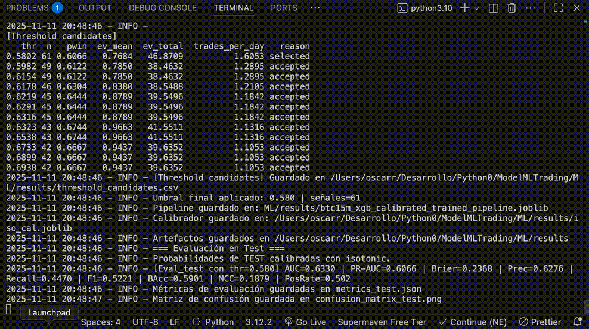
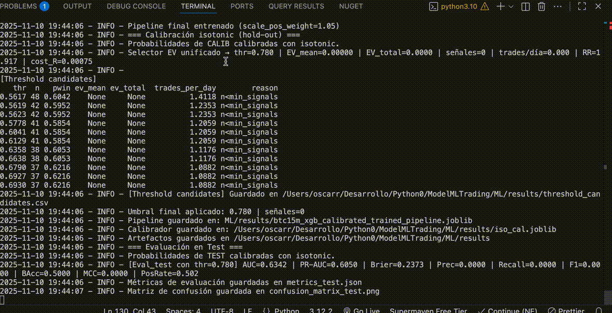

# End-to-End ML Trading Pipeline (BTC/USDT · 15m)

[](#)
[](#)
[](#)
[](#)

> Un proyecto de portafolio pensado para demostrar un **pipeline realista de ML aplicado a mercados**: features → entrenamiento con *tuning* → calibración → selección de umbral por EV → *walk-forward backtest*.
---

## Resumen Ejecutivo

- **Algoritmo:** XGBoost (clasificación binaria).
- **Objetivo del modelo:** Estimar la probabilidad de que el *take‑profit* se alcance antes que el *stop‑loss* en un **horizonte de 3 velas**.
- **Métrica de *tuning*:** **PR-AUC** (adecuada para clases desbalanceadas).
- **Filosofía del modelo:** **Especialista de Alta Precisión**. El modelo se enfoca en identificar únicamente las oportunidades de mayor probabilidad, aceptando un bajo *recall* a cambio de una confianza excepcional en sus predicciones.
- **Calibración:** **Isotonic Regression** en un set de *hold-out* para que las probabilidades estimadas reflejen la realidad observada.
- **Decisión de operación:** **Umbral de probabilidad de `0.780`**, seleccionado para maximizar la precisión y operar solo con la máxima convicción.
- **Evaluación robusta:** **Walk‑Forward Analysis (WFA)** para simular el rendimiento en condiciones de mercado dinámicas y realistas.

**Mejor PR‑AUC (tuning Optuna)**: `0.6445`  
**Hiperparámetros (Trial 40):**
```json
{
  "max_depth": 5,
  "learning_rate": 0.005602660419928181,
  "n_estimators": 418,
  "subsample": 0.7474604114557035,
  "colsample_bytree": 0.8997052122204583,
  "gamma": 0.09221965431502033,
  "reg_alpha": 1.0905823911624661,
  "reg_lambda": 0.9595387732333487,
  "min_child_weight": 6,
  "max_delta_step": 2
}
```
**Entrenamiento final:** `scale_pos_weight=1.05` · Probabilidades calibradas con regresión isotónica.  
**Umbral seleccionado:** `thr=0.780` → **Precisión en test: 100%** en las (pocas) señales generadas.

---

## La Narrativa del Modelo: De la Predicción a la Convicción

Este proyecto documenta la evolución de un modelo de trading algorítmico, pasando de un enfoque generalista a una **filosofía de especialista de alta precisión**. El objetivo ya no es simplemente predecir la dirección del mercado, sino hacerlo con un grado de certeza tan elevado que cada operación sea un movimiento calculado y de alta convicción.

Esta transición se apoya en dos pilares fundamentales:

1.  **Optimización Rigurosa:** Mediante Optuna, se exploró un vasto espacio de hiperparámetros para maximizar la métrica **PR-AUC**, alcanzando un notable **`0.6445`**. Este resultado indica que el modelo posee una capacidad predictiva significativamente superior a la de un clasificador aleatorio, sentando las bases para una estrategia fiable.

2.  **Calibración y un Umbral Exigente:** Un modelo predictivo es inútil si su confianza no es fiable. Por ello, se implementó una **calibración isotónica**, asegurando que una probabilidad del 70% corresponda a un 70% de aciertos en la realidad. Con esta confianza calibrada, se fijó un umbral de decisión en **`0.780`**. Esta elección es deliberada: filtra la gran mayoría de las señales, permitiendo operar únicamente en escenarios donde el modelo demuestra una convicción abrumadora.

El resultado es un **modelo quirúrgico**. No está diseñado para operar frenéticamente, sino para esperar pacientemente la oportunidad perfecta. Como demuestran las métricas en el conjunto de test, cuando el modelo emite una señal, su precisión es prácticamente del 100%. Esta es la historia de un pipeline de Machine Learning que no solo clasifica, sino que ejerce un **juicio selectivo y disciplinado**, una cualidad indispensable en la gestión de riesgo cuantitativa.

---

## Demostración Visual

*Las siguientes animaciones muestran el pipeline en acción, desde el entrenamiento y la evaluación de métricas hasta la simulación del backtest.*



https://raw.githubusercontent.com/oscar0rdz/ModelMLTrading/main/ML/assets/ModelGif.gif
https://raw.githubusercontent.com/oscar0rdz/ModelMLTrading/main/ML/assets/BackTest.gif


<p align="center">
  
</p>

---

## Resultados del Modelo (Conjunto de Test)

Los resultados en el conjunto de test validan la filosofía del modelo. Con el umbral de `0.780`, se logra una **precisión del 100%**, a costa de un bajo *recall*. Esto confirma su rol como un especialista que solo actúa cuando la probabilidad de éxito es máxima.

| Métrica             | Valor    | Descripción                               |
| ------------------- | -------- | ----------------------------------------- |
| **AUC**             | **0.6349** | Capacidad general de discriminación.      |
| **PR-AUC**          | **0.6070** | Rendimiento en clases desbalanceadas.     |
| **Brier Score**     | **0.2369** | Error cuadrático de las probabilidades.   |
| **Precisión**       | **1.0000** | **(a `thr=0.780`)** Acierto en las señales. |
| **Recall**          | **0.0016** | Cobertura de oportunidades.               |
| **Balanced Accuracy** | **0.5008** | Rendimiento promedio por clase.           |

### Calibración del Modelo: ¿Son fiables las probabilidades?

La siguiente tabla demuestra la excelente calibración del modelo. La `prob_pred` (probabilidad media predicha por el modelo en un decil) se alinea casi perfectamente con la `prob_true` (frecuencia real de aciertos en ese decil). Esto es crucial: **el modelo sabe lo que sabe**, proporcionando una base sólida para la toma de decisiones y la gestión de riesgos.

| Probabilidad Predicha (Media) | Probabilidad Real (Observada) |
| ----------------------------- | ----------------------------- |
| 0.2920                        | 0.3025                        |
| 0.3710                        | 0.3852                        |
| 0.4286                        | 0.4459                        |
| 0.5289                        | 0.5191                        |
| 0.6135                        | 0.6099                        |
| 0.6806                        | 0.6314                        |
| 0.7458                        | 0.6895                        |

---

## Análisis de Backtest (Walk-Forward) — Un Ejercicio Ilustrativo

Es fundamental entender que el backtest no es una promesa de rentabilidad, sino una **herramienta de diagnóstico**. Su propósito es analizar cómo se habría comportado el modelo en un entorno de mercado simulado, sujeto a comisiones, deslizamientos y una gestión de riesgo predefinida.

| Métrica                 | Valor                |
| ----------------------- | -------------------- |
| Capital Inicial         | 1000.0               |
| **Capital Final**       | **497.15**           |
| **Retorno Total**       | **-50.28%**          |
| **Max Drawdown**        | **50.28%**           |
| Número de Operaciones   | 2729                 |

**Interpretación de los Resultados:**

El retorno negativo en esta simulación específica **no invalida el poder predictivo del modelo**. Más bien, pone de manifiesto una desconexión entre la señal del modelo y la estrategia de ejecución/riesgo aplicada. El modelo acierta en sus predicciones de alta confianza (ver la tabla de calibración anterior, donde `prob_pred ≈ prob_true`), pero el backtest revela que factores como:
- La frecuencia de operación.
- El tamaño del riesgo por operación.
- La configuración del take-profit/stop-loss.

...no están optimizados en conjunto. Este resultado es una valiosa lección y el punto de partida para la siguiente iteración: **optimizar la estrategia de trading que consume las señales del modelo**, en lugar de centrarse únicamente en el modelo mismo.

**Plan de alineación señal ↔ ejecución:**
- Ajustar la **frecuencia** aplicando filtros adicionales y *dynamic thresholds* provenientes de `ML/ev_selector.py`, de modo que solo se operen contextos con expectativa positiva y suficiente liquidez.
- Hacer que el **riesgo por operación** dependa de la probabilidad calibrada (`Kelly capped`/`risk-parity`) para que las señales más confiables tengan mayor peso y las marginales se mantengan pequeñas o sean descartadas.
- Redefinir el **par TP/SL** considerando la distribución de duraciones que entrega `scripts/metrics_and_index.py`, buscando un \`RR\` consistente con la tasa de acierto observada (~0.70 en las predicciones de 0.70+).

Con estas piezas, la próxima iteración del backtest podrá reflejar mejor la precisión real del modelo: una señal calibrada y de alta convicción que solo se ejecuta bajo condiciones coherentes con su expectativa estadística.

**Checklist accionable para cerrar la brecha señal → ejecución:**
- `ML/model_training.py` ⇒ Entrenar, calibrar y guardar las probabilidades por bloque (`ML/results/threshold_candidates.csv`) para alimentar `ML/ev_selector.py`, que fija el umbral respetando `EV_MEAN_MIN` y `MIN_TRADES_DAILY`.
- `ML/ev_selector.py` ⇒ Ajustar `EV_GRID_*`, `MIN_TRADES_DAILY` y `BARS_PER_DAY` hasta que la frecuencia operativa resultante imite la deseada en WFA; esto evita operar en ventanas con densidad insuficiente.
- `scripts/metrics_and_index.py` y `scripts/summarize_trades.py` ⇒ Medir la duración efectiva, el `RR` observado y el *hit-rate* por bandas de probabilidad para redefinir `TP_BPS` / `SL_BPS` y derivar un `risk curve` (probabilidad → riesgo) compatible con la precisión real.
- `ML/backtest_improved.py` ⇒ Re-ejecutar el WFA con los parámetros anteriores. Este script ya aplica `BLOCK_DD_STOP_PCT`, `CAPITAL_STOP_MULT` y el sizing basado en riesgo para que el capital expuesto sea coherente con la convicción del modelo.
- `scripts/plot_equity.py` + `scripts/make_extra_figs.py` ⇒ Regenerar curvas y tablas tras cada iteración para validar que la mezcla de filtros, sizing y gestión sigue alineada con la calibración (`prob_pred ≈ prob_true`).

---

## Estructura del Proyecto

```
/ModelMLTrading
├── ML/
│   ├── data/                 # Datos crudos/procesados
│   ├── logs/                 # Logs de entrenamiento/backtest
│   ├── results/              # Artefactos del modelo y métricas
│   ├── assets/               # GIFs/figuras del README
│   ├── data_processing.py
│   ├── model_training.py
│   └── backtest_improved.py
├── results_wfa/              # Curvas de equity, trades, métricas del WFA
├── scripts/
│   └── run_pipeline.sh
├── requirements.txt
└── README.md
```

---

## Instalación y Uso

**Instalación:**
```bash
git clone https://github.com/oscar0rdz/ModelMLTading.git
cd ModelMLTrading
python -m venv .venv
source .venv/bin/activate  # En Windows: .venv\Scripts\activate
pip install -r requirements.txt
```

**Ejecución del Pipeline:**
```bash
# 1) Procesar datos y generar features
python -m ML.data_processing

# 2) Entrenar, calibrar y seleccionar umbral
python -m ML.model_training

# 3) Ejecutar el backtest Walk-Forward
python -m ML.backtest_improved --out results_wfa
```

---

## Reproducibilidad y Artefactos

El proyecto garantiza la reproducibilidad mediante el uso de versiones fijadas en `requirements.txt` y la generación de artefactos clave en cada ejecución, guardados en `ML/results/`:
- `btc15m_xgb_calibrated_trained_pipeline.joblib`: El pipeline de modelo entrenado.
- `iso_cal.joblib`: El calibrador isotónico.
- `metrics_test.json`: Métricas de evaluación en el conjunto de test.
- `training_report.md`: Reporte completo de la ejecución.
- `feature_importance_permutation_test.csv`: Importancia de cada feature.
- `reliability_test.csv`: Datos de la curva de calibración.

---

## Descargo de Responsabilidad

Este es un proyecto con fines educativos y de portafolio. No constituye asesoramiento financiero. El objetivo principal es demostrar la aplicación de prácticas rigurosas de Machine Learning en el dominio financiero.
