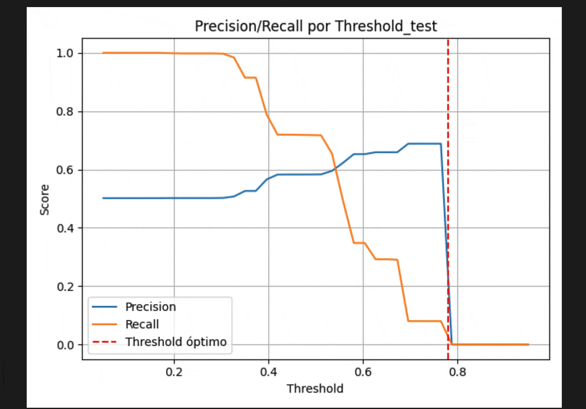
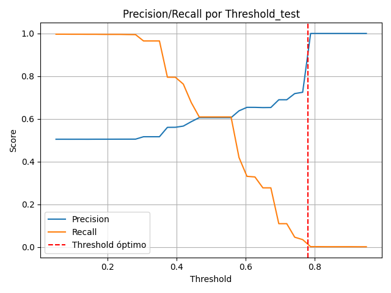
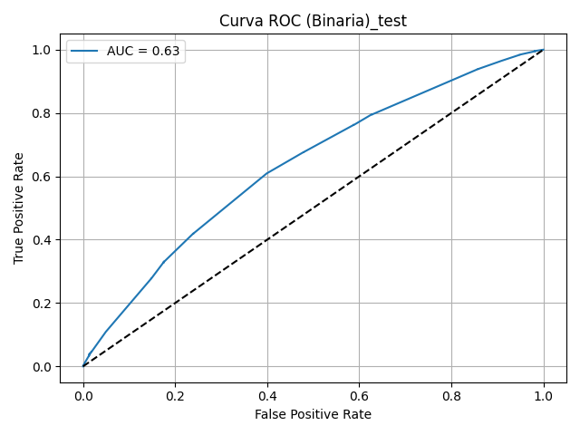
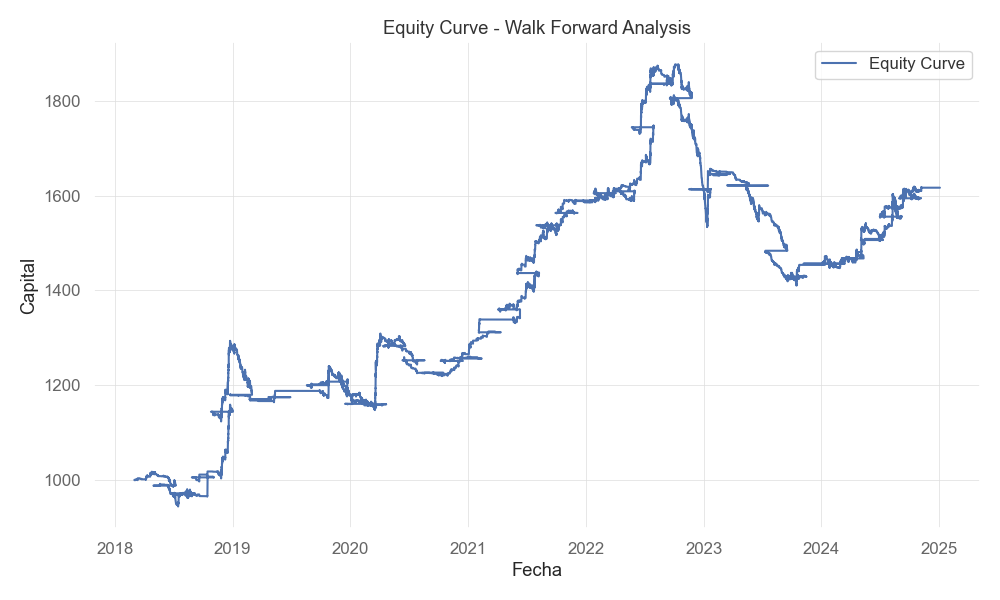

# End-to-End ML Trading Pipeline (BTC/USDT · 15m)

[](#)
[](#)
[](#)
[](#)

> Un proyecto de portafolio pensado para demostrar un **pipeline realista de ML aplicado a mercados**: features → entrenamiento con *tuning* → calibración → selección de umbral por EV → *walk-forward backtest*. No es consejo financiero.

---

## Resumen ejecutivo

- **Algoritmo:** XGBoost (clasificación binaria).  
- **Objetivo del modelo:** estimar la probabilidad de que el *take‑profit* se alcance antes que el *stop‑loss* en un **horizonte de 3 velas**.  
- **Métrica de *tuning*:** **PR‑AUC** (adecuada con desbalance).  
- **Calibración:** **Isotonic Regression** en *hold‑out*.  
- **Decisión de operación:** **umbral por Expected Value (EV)** con **costos** (comisión + *slippage*) y **R:R** explícita.  
- **Evaluación robusta:** **Walk‑Forward Analysis (WFA)** con *position sizing* fraccional y **stop global**.

**Mejor PR‑AUC (tuning)**: `0.6444`  
**Hiperparámetros (Optuna):**
```json
{
  "max_depth": 6,
  "learning_rate": 0.007124396889931562,
  "n_estimators": 324,
  "subsample": 0.6523258652711477,
  "colsample_bytree": 0.9449669831236716,
  "gamma": 1.7028516279302248,
  "reg_alpha": 1.9001784244924378,
  "reg_lambda": 2.1459862304150406,
  "min_child_weight": 10,
  "max_delta_step": 0
}
```
**Entrenamiento final:** `scale_pos_weight=1.05` · Probabilidades calibradas con isotónica.  
**Umbral EV seleccionado:** `thr=0.582` → `señales=47` (**≈1.38 trades/día**), **EV_mean=0.7368**, **EV_total=34.63**, **RR=1.917**, **cost_R=0.00075**.

---

## Storytelling — de la pregunta a la decisión operable

La meta inicial fue sencilla: **convertir probabilidades en decisiones que valgan la pena** en el marco de 15m. Tras construir *features* y fijar **PR‑AUC** como métrica, ejecuté **Optuna**. La búsqueda no fue lineal: *trials* 40–41 se movieron en `0.642–0.644`, el 42 fue *pruned* y el **trial 12** fijó el tope con `0.64437`. Esa región de hiperparámetros (profundidad 6, `min_child_weight≈10`, `colsample_bytree≈0.94`, `gamma≈1.7`) mostró **estabilidad**.  

Con el *setup* ganador entrené el **pipeline final**, ajusté `scale_pos_weight=1.05` y **calibré** con isotónica. La conversación dejó de ser “¿clasifica?” para convertirse en “**¿cuándo opero?**”. Ahí entra el **selector de EV**: **`thr=0.582`** ofrece cobertura razonable (47 señales) y un **EV** positivo bajo costos, listo para pasar al WFA.

---

## Demo visual (GIFs)

> Coloca los GIFs en `ML/assets/` con **estos nombres y extensión `.gif`**. Si no aparecen en GitHub, usa las *URLs RAW* indicadas en comentarios del código o activa Git LFS para archivos pesados.


<p align="center">
  
</p>

---

## Cómo funciona y **por qué** se hace así

1. **Procesamiento & *feature engineering*** (`ML/data_processing.py`)  
   - **Qué:** OHLCV de **BTC/USDT** (15m) + indicadores técnicos (SMA/EMA, RSI, MACD, ATR, Bandas de Bollinger, ADX, OBV, etc.).  
   - **Por qué:** mejorar **señal‑ruido** y capturar **tendencia, momentum y volatilidad**; el modelo aprende patrones que por sí solos no están en el precio bruto.  
   - **Etiquetado dinámico (ATR, 3 velas):** TP/SL se escalan con volatilidad. **Por qué:** evita metas fijas desalineadas con el régimen de mercado.

2. **Entrenamiento & *tuning*** (`ML/model_training.py`)  
   - **Qué:** búsqueda con **Optuna** + validación temporal con **purge/embargo**.  
   - **Por qué:** evitar *leakage* por dependencia temporal y converger hacia **hiperparámetros estables** que maximizan **PR‑AUC**.

3. **Calibración** (isotónica, *hold‑out*)  
   - **Qué:** ajustar *scores* a **probabilidades fieles**.  
   - **Por qué:** si la probabilidad “70%” no corresponde a 70% observado, el control de riesgo y el **EV** se distorsionan.

4. **Selección de umbral por EV**  
   - **Qué:** elegir `thr` que **maximiza valor esperado** bajo **costos** y **R:R**.  
   - **Por qué:** pasar de clasificación a **decisión económica**; umbrales con alta *precision* pero **cobertura nula** no sirven para operar.

5. **Walk‑Forward Backtest** (`ML/backtest_improved.py`)  
   - **Qué:** ventanas *train→test* deslizantes con **comisiones**, **slippage**, **límite de operaciones** y **stop global**.  
   - **Por qué:** **realismo y robustez**; medir desempeño fuera de muestra y bajo fricción.

---

## Resultados del modelo (Test)

**Probabilidades calibradas**; **umbral aplicado = 0.582**.

| Métrica | Valor |
|---|---|
| AUC | **0.6364** |
| PR‑AUC | **0.6121** |
| Brier score | **0.2365** |
| Precisión | **0.6362** |
| Recall | **0.4085** |
| F1 | **0.4975** |
| Balanced Accuracy | **0.5866** |
| MCC | **0.1853** |
| PosRate (y=1) | **0.502** |

**Umbral y candidatos (extracto):**
```
thr     n   pwin   ev_mean   ev_total   trades_per_day    reason
0.5823  47  0.5957  0.7368   34.6314    1.3824            selected
0.6015  40  0.6000  0.7492   29.9700    1.1765            accepted
0.6304  40  0.6000  0.7492   29.9700    1.1765            accepted
0.6379  40  0.6000     NaN       NaN    1.1765            n<min_signals
```

**EV por decil de `p_up` (proxy):**
```
dec  n     p_mean   hit     ev_proxy
0    1899  0.3557   0.3402  -0.0086
1    1708  0.4051   0.4256   0.2407
2     762  0.5125   0.4829   0.4078
3     835  0.5499   0.5305   0.5467
4    1112  0.5783   0.5773   0.6832
5     598  0.6415   0.6221   0.8136
6     935  0.6902   0.6289   0.8335
7     776  0.7441   0.6985   1.0364
```

**Figuras (colócalas en `ML/assets/`):**  
  
  


---

## Backtest Walk‑Forward (WFA)

- **Selector EV**: `thr=0.582` → `señales=47` (**≈1.38 trades/día**).  
- **Diagnóstico**: cobertura razonable; conviene iterar *cost‑aware tuning* y **guard‑rails** (mínimo de señales, `thr_max` dinámico, *recall* objetivo) para estabilizar la **curva de equity**.



---

## Estructura del proyecto

```
/ModelMLTrading
├── ML/
│   ├── data/                 # Datos crudos/procesados
│   ├── logs/                 # Logs de entrenamiento/backtest
│   ├── results/              # Artefactos del modelo y métricas
│   ├── assets/               # GIFs/figuras del README
│   ├── data_processing.py
│   ├── model_training.py
│   └── backtest_improved.py
├── results_wfa/              # Curvas de equity, trades, métricas del WFA
├── scripts/
│   └── run_pipeline.sh
├── requirements.txt
└── README.md
```

---

## Instalación

```bash
git clone https://github.com/oscar0rdz/ModelMLTading.git
cd ModelMLTrading  # ajusta si tu carpeta local tiene otro nombre
python -m venv .venv
source .venv/bin/activate  # Windows: .venv\Scriptsctivate
pip install -r requirements.txt
```

## Uso

```bash
# 1) Procesar datos
python -m ML.data_processing

# 2) Entrenar + calibrar + seleccionar umbral por EV
python -m ML.model_training

# 3) Backtest Walk-Forward
python -m ML.backtest_improved --out results_wfa
```

---

## Configuración (.env)

```dotenv
# === Datos & Paths ===
SYMBOL="BTCUSDT"
INTERVAL="15m"
START="2017-03-01"
DATA_DIR="ML/data"
RESULTS_DIR="ML/results"

# === Entrenamiento ===
TEST_SIZE=0.3
N_TRIALS=100
K_VOL=1.8
LOOK_AHEAD=3

# === Backtesting (WFA) ===
INITIAL_CAPITAL=1000.0
RISK_PER_TRADE=0.008
COMMISSION_RATE=0.0002
SLIPPAGE_PCT=0.0001
TRAIN_BARS=9000
TEST_BARS=2500
STEP_BARS=500
```

---

## Reproducibilidad y artefactos

- Versiones fijadas en `requirements.txt`.  
- Validación temporal con **purge/embargo**.  
- Artefactos guardados: `*_trained_pipeline.joblib`, `iso_cal.joblib`, `metrics_test.json`, `threshold_candidates.csv`, `reliability_test.csv`, `classification_report_test.txt`, `feature_importance_permutation_test.csv`.

---

## Troubleshooting de GIFs

```bash
# Verifica que existen y están versionados
ls -la ML/assets
git ls-files | grep -i 'ML/assets/.*\.gif$' || echo "No hay GIFs versionados"

# Si pesan mucho, usa LFS
git lfs install
git lfs track "*.gif"
git add .gitattributes ML/assets/*.gif
git commit -m "Track GIFs con LFS"
git push
```

---

## Descargo de responsabilidad

Proyecto formativo. No constituye consejo financiero. El foco es ingeniería de ML y buenas prácticas de evaluación y riesgo.
